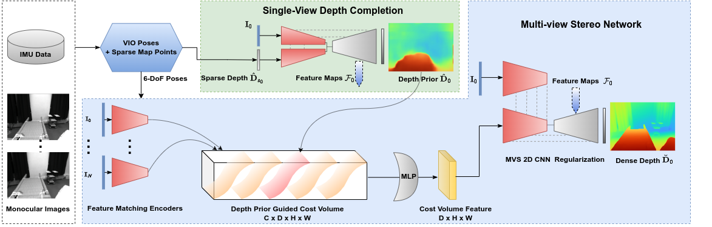

<h1 align="center">SimpleMapping: Real-Time Visual-Inertial Dense Mapping with Deep Multi-View Stereo</h1>
<p align="center">
    <a href="https://yingyexin.github.io/">Yingye Xin</a><sup>1*</sup> &emsp;&emsp;
    <a href="https://xingxingzuo.github.io/">Xingxing Zuo</a><sup>1,2*,&dagger;</sup> &emsp;&emsp;
    <a href="https://dylanorange.github.io/">Dongyue Lu</a><sup>1</sup> &emsp;&emsp;
    <a href="https://www.professoren.tum.de/en/leutenegger-stefan">Stefan Leutenegger</a><sup>1,2</sup>
</p>

<p align="center">
    <sup>*</sup>equal contribution&emsp;&emsp;&emsp;
    <sup>&dagger;</sup>corresponding author
</p>

<p align="center">
    <sup>1</sup>Smart Robotics Lab, Technical University of Munich&emsp;&emsp;&emsp;
    <sup>2</sup>Munich Center for Machine Learning (MCML)
</p>

<p align="center">
    IEEE International Symposium on Mixed and Augmented Reality (ISMAR) 2023, Sydney, Australia
</p>

<p align="center">
    <a href="https://arxiv.org/pdf/2306.08648.pdf">arXiv</a> |
    <a href="https://www.youtube.com/watch?v=0T_vt5myvVY">Video</a> |
    <a href="https://yingyexin.github.io/simplemapping.html">Project Page</a>
</p>

<p align="center">
  
</p>

## TODOs
- [x] 📣 C++ code is released with pretrained model in May 2024! Please check [SimpleMapping/](SimpleMapping/).
- [ ] 📣 SPA-MVSNet will be released soon under the folder [SPA-MVSNet/](SPA-MVSNet/).


## Abstract
<p align="justify">We present SimpleMapping, a real-time visual-inertial dense mapping method capable of performing incremental 3D mesh reconstruction with high quality using only sequential monocular images and inertial measurement unit (IMU) readings.
6-DoF camera poses are estimated by a robust feature-based visual-inertial odometry (VIO), which also generates noisy sparse 3D map points as a by-product. We propose a sparse point aided multi-view stereo neural network (SPA-MVSNet) that can effectively leverage the informative but noisy sparse points from the VIO system. The sparse depth from VIO is firstly completed by a single-view depth completion network. This dense depth map, although naturally limited in accuracy, is then used as a prior to guide our MVS network in the cost volume generation and regularization for accurate dense depth prediction. Predicted depth maps of keyframe images by the MVS network are incrementally fused into a global map using TSDF-Fusion. We extensively evaluate both the proposed SPA-MVSNet and the entire dense mapping system on several public datasets as well as our own dataset, demonstrating the system’s impressive generalization capabilities and its ability to deliver high-quality 3D reconstruction online. Our proposed dense mapping system achieves a 39.7% improvement in F-score over existing systems when evaluated on the challenging scenarios of the EuRoC dataset.</p>

<p align="center">
  
</p>


## BibTeX
If you find this repository helpful, please cite our paper and give us a star!

```
@article{Xin2023ISMAR,
    author={Xin, Yingye and Zuo, Xingxing and Lu, Dongyue and Leutenegger, Stefan},
    title={{SimpleMapping: Real-Time Visual-Inertial Dense Mapping with Deep Multi-View Stereo}},
    booktitle={IEEE International Symposium on Mixed and Augmented Reality (ISMAR)},
    month={Oct},
    year={2023}
}
```